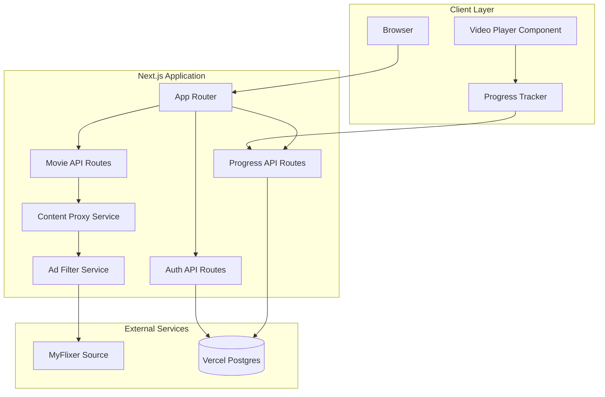
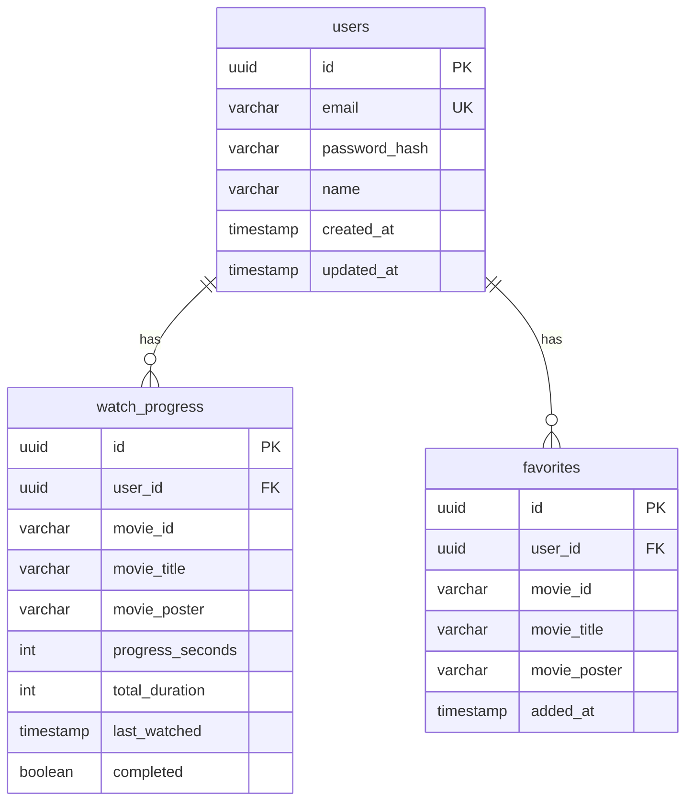
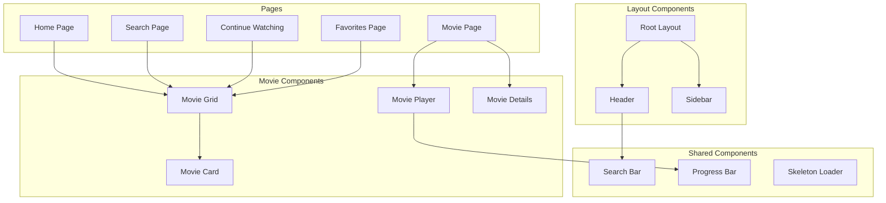
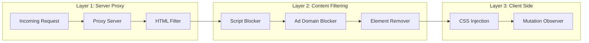
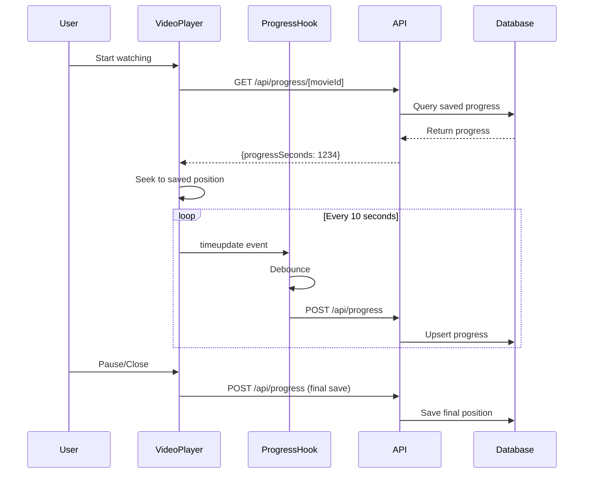
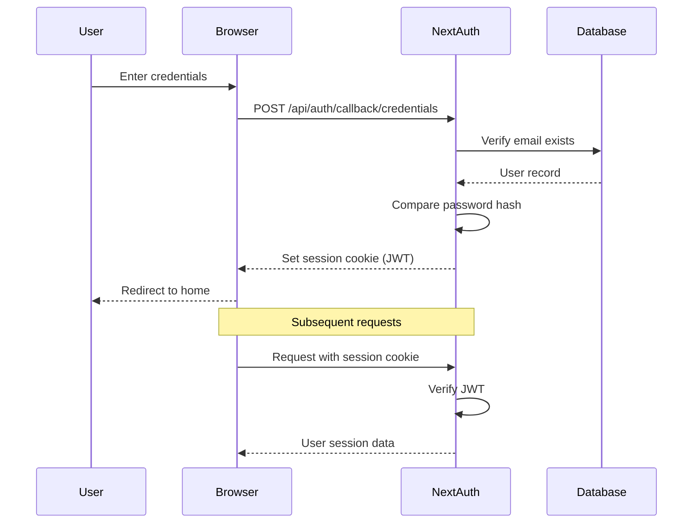

# Freeflix Architecture

A movie streaming platform that allows users to search and watch movies with automatic progress tracking, built with Next.js and deployed to Vercel.

## System Overview



## Tech Stack

| Layer | Technology | Purpose |
|-------|------------|---------|
| Framework | Next.js 14+ (App Router) | Full-stack React framework with SSR/SSG |
| Database | Vercel Postgres | User data, watch progress, favorites |
| ORM | Drizzle ORM | Type-safe database queries |
| Authentication | NextAuth.js v5 | Email/password credentials |
| Styling | Tailwind CSS | Utility-first CSS framework |
| Video Player | Custom HTML5 / Plyr.js | Video playback with progress events |
| Deployment | Vercel | Serverless deployment platform |

## Database Schema



### SQL Schema

```sql
-- Users table
CREATE TABLE users (
    id UUID PRIMARY KEY DEFAULT gen_random_uuid(),
    email VARCHAR(255) UNIQUE NOT NULL,
    password_hash VARCHAR(255) NOT NULL,
    name VARCHAR(255),
    created_at TIMESTAMP DEFAULT CURRENT_TIMESTAMP,
    updated_at TIMESTAMP DEFAULT CURRENT_TIMESTAMP
);

-- Watch progress table
CREATE TABLE watch_progress (
    id UUID PRIMARY KEY DEFAULT gen_random_uuid(),
    user_id UUID NOT NULL REFERENCES users(id) ON DELETE CASCADE,
    movie_id VARCHAR(255) NOT NULL,
    movie_title VARCHAR(500),
    movie_poster VARCHAR(500),
    progress_seconds INTEGER DEFAULT 0,
    total_duration INTEGER,
    last_watched TIMESTAMP DEFAULT CURRENT_TIMESTAMP,
    completed BOOLEAN DEFAULT FALSE,
    UNIQUE(user_id, movie_id)
);

-- Favorites table
CREATE TABLE favorites (
    id UUID PRIMARY KEY DEFAULT gen_random_uuid(),
    user_id UUID NOT NULL REFERENCES users(id) ON DELETE CASCADE,
    movie_id VARCHAR(255) NOT NULL,
    movie_title VARCHAR(500),
    movie_poster VARCHAR(500),
    added_at TIMESTAMP DEFAULT CURRENT_TIMESTAMP,
    UNIQUE(user_id, movie_id)
);

-- Indexes for performance
CREATE INDEX idx_watch_progress_user ON watch_progress(user_id);
CREATE INDEX idx_watch_progress_last_watched ON watch_progress(last_watched DESC);
CREATE INDEX idx_favorites_user ON favorites(user_id);
```

## Project Structure

```
freeflix/
├── app/
│   ├── (auth)/
│   │   ├── login/
│   │   │   └── page.tsx
│   │   ├── register/
│   │   │   └── page.tsx
│   │   └── layout.tsx
│   ├── (main)/
│   │   ├── page.tsx                 # Home/Browse
│   │   ├── search/
│   │   │   └── page.tsx             # Search results
│   │   ├── movie/
│   │   │   └── [id]/
│   │   │       └── page.tsx         # Movie details & player
│   │   ├── continue-watching/
│   │   │   └── page.tsx
│   │   ├── favorites/
│   │   │   └── page.tsx
│   │   └── layout.tsx
│   ├── api/
│   │   ├── auth/
│   │   │   └── [...nextauth]/
│   │   │       └── route.ts
│   │   ├── movies/
│   │   │   ├── search/
│   │   │   │   └── route.ts         # Search proxy
│   │   │   ├── [id]/
│   │   │   │   └── route.ts         # Movie details proxy
│   │   │   └── stream/
│   │   │       └── route.ts         # Stream proxy with ad filtering
│   │   ├── progress/
│   │   │   ├── route.ts             # GET/POST progress
│   │   │   └── [movieId]/
│   │   │       └── route.ts         # Single movie progress
│   │   └── favorites/
│   │       └── route.ts
│   ├── layout.tsx
│   └── globals.css
├── components/
│   ├── ui/                          # Reusable UI components
│   │   ├── button.tsx
│   │   ├── input.tsx
│   │   ├── card.tsx
│   │   └── skeleton.tsx
│   ├── auth/
│   │   ├── login-form.tsx
│   │   └── register-form.tsx
│   ├── movie/
│   │   ├── movie-card.tsx
│   │   ├── movie-grid.tsx
│   │   ├── movie-player.tsx
│   │   └── movie-details.tsx
│   ├── search/
│   │   └── search-bar.tsx
│   ├── layout/
│   │   ├── header.tsx
│   │   ├── footer.tsx
│   │   └── sidebar.tsx
│   └── progress/
│       └── continue-watching-row.tsx
├── lib/
│   ├── db/
│   │   ├── index.ts                 # Database connection
│   │   ├── schema.ts                # Drizzle schema
│   │   └── queries.ts               # Database queries
│   ├── auth/
│   │   ├── config.ts                # NextAuth configuration
│   │   └── utils.ts                 # Auth utilities
│   ├── services/
│   │   ├── myflixer.ts              # MyFlixer API integration
│   │   ├── ad-filter.ts             # Ad filtering logic
│   │   └── progress.ts              # Progress tracking service
│   └── utils/
│       ├── cn.ts                    # Class name utility
│       └── debounce.ts
├── hooks/
│   ├── use-progress.ts              # Progress tracking hook
│   ├── use-search.ts                # Search with debounce
│   └── use-favorites.ts
├── types/
│   ├── movie.ts
│   ├── user.ts
│   └── progress.ts
├── middleware.ts                    # Auth middleware
├── drizzle.config.ts
├── next.config.js
├── tailwind.config.ts
├── package.json
└── .env.local
```

## API Routes Specification

### Authentication

#### POST `/api/auth/register`
Register a new user.

```typescript
// Request
{
  email: string;
  password: string;
  name?: string;
}

// Response
{
  success: boolean;
  user?: { id: string; email: string; name: string };
  error?: string;
}
```

#### POST `/api/auth/[...nextauth]`
NextAuth.js handles login/logout/session.

### Movies

#### GET `/api/movies/search?q={query}`
Search for movies via proxy.

```typescript
// Response
{
  results: Array<{
    id: string;
    title: string;
    poster: string;
    year: string;
    type: "movie" | "series";
    rating?: string;
  }>;
}
```

#### GET `/api/movies/[id]`
Get movie details and available streams.

```typescript
// Response
{
  id: string;
  title: string;
  poster: string;
  backdrop?: string;
  description: string;
  year: string;
  duration: string;
  rating: string;
  genres: string[];
  cast: string[];
  streams: Array<{
    server: string;
    quality: string;
    url: string;  // Proxied URL
  }>;
}
```

#### GET `/api/movies/stream?url={encodedUrl}`
Proxy and filter the video stream content.

### Progress

#### GET `/api/progress`
Get all watch progress for current user.

```typescript
// Response
{
  items: Array<{
    movieId: string;
    movieTitle: string;
    moviePoster: string;
    progressSeconds: number;
    totalDuration: number;
    progressPercent: number;
    lastWatched: string;
    completed: boolean;
  }>;
}
```

#### POST `/api/progress`
Save/update watch progress.

```typescript
// Request
{
  movieId: string;
  movieTitle: string;
  moviePoster: string;
  progressSeconds: number;
  totalDuration: number;
}

// Response
{ success: boolean }
```

#### GET `/api/progress/[movieId]`
Get progress for a specific movie.

### Favorites

#### GET `/api/favorites`
List all favorites.

#### POST `/api/favorites`
Add to favorites.

#### DELETE `/api/favorites/[movieId]`
Remove from favorites.

## Component Architecture



### Key Component: Movie Player

```typescript
interface MoviePlayerProps {
  movieId: string;
  streamUrl: string;
  title: string;
  poster: string;
  initialProgress?: number;
  onProgressUpdate: (seconds: number) => void;
}

// Features:
// - HTML5 video with custom controls
// - Progress tracking via timeupdate event
// - Debounced progress saving (every 10 seconds)
// - Resume from saved position
// - Keyboard shortcuts (space, arrows, f for fullscreen)
// - Quality selector
// - Fullscreen support
```

## Ad Blocking Strategy

The ad blocking system uses a multi-layered approach:



### Implementation Details

#### 1. Server-Side Proxy (`/api/movies/stream`)

```typescript
// Responsibilities:
// - Fetch content from MyFlixer
// - Remove known ad scripts and iframes
// - Strip tracking pixels
// - Rewrite URLs to go through proxy
// - Block requests to known ad domains
```

#### 2. Ad Domain Blocklist

```typescript
const AD_DOMAINS = [
  'doubleclick.net',
  'googlesyndication.com',
  'adservice.google.com',
  'popads.net',
  'popcash.net',
  'propellerads.com',
  // ... extensive list
];

const AD_SELECTORS = [
  '[class*="ad-"]',
  '[class*="ads-"]',
  '[id*="ad-"]',
  '[id*="ads-"]',
  'iframe[src*="ads"]',
  '.popup',
  '.overlay-ad',
  // ... common ad selectors
];
```

#### 3. HTML Sanitization

```typescript
// Remove:
// - <script> tags from ad domains
// - <iframe> elements pointing to ad networks
// - onclick handlers that open popups
// - Elements matching ad selectors
// - Tracking pixels ( with 1x1 dimensions)
```

#### 4. Client-Side Protection

```typescript
// CSS injection to hide any remaining ads
const adBlockStyles = `
  [class*="ad-"], [class*="ads-"],
  [id*="ad-"], [id*="ads-"],
  .popup, .overlay { 
    display: none !important; 
  }
`;

// Mutation observer to catch dynamically injected ads
const observer = new MutationObserver((mutations) => {
  mutations.forEach((mutation) => {
    mutation.addedNodes.forEach((node) => {
      if (isAdElement(node)) {
        node.remove();
      }
    });
  });
});
```

## Watch Progress Tracking



### Progress Hook Implementation

```typescript
function useProgressTracking(movieId: string) {
  const saveProgress = useDebouncedCallback(
    async (currentTime: number, duration: number) => {
      await fetch('/api/progress', {
        method: 'POST',
        body: JSON.stringify({
          movieId,
          progressSeconds: Math.floor(currentTime),
          totalDuration: Math.floor(duration),
        }),
      });
    },
    10000 // Save every 10 seconds max
  );

  return { saveProgress };
}
```

## Authentication Flow



### NextAuth Configuration

```typescript
// lib/auth/config.ts
export const authOptions: NextAuthConfig = {
  providers: [
    CredentialsProvider({
      name: 'credentials',
      credentials: {
        email: { label: 'Email', type: 'email' },
        password: { label: 'Password', type: 'password' },
      },
      async authorize(credentials) {
        const user = await db.query.users.findFirst({
          where: eq(users.email, credentials.email),
        });
        
        if (!user) return null;
        
        const valid = await bcrypt.compare(
          credentials.password,
          user.passwordHash
        );
        
        if (!valid) return null;
        
        return { id: user.id, email: user.email, name: user.name };
      },
    }),
  ],
  session: { strategy: 'jwt' },
  pages: {
    signIn: '/login',
  },
};
```

## Environment Variables

```bash
# .env.local

# Database (Vercel Postgres)
POSTGRES_URL="postgres://..."
POSTGRES_PRISMA_URL="postgres://..."
POSTGRES_URL_NON_POOLING="postgres://..."

# NextAuth
NEXTAUTH_URL="http://localhost:3000"
NEXTAUTH_SECRET="your-secret-key"

# MyFlixer (if needed)
MYFLIXER_BASE_URL="https://myflixerz.to"
```

## Deployment Configuration

### Vercel Configuration

```json
// vercel.json
{
  "functions": {
    "app/api/movies/stream/route.ts": {
      "maxDuration": 30
    }
  },
  "headers": [
    {
      "source": "/api/(.*)",
      "headers": [
        { "key": "Cache-Control", "value": "no-store" }
      ]
    }
  ]
}
```

### Next.js Configuration

```javascript
// next.config.js
/** @type {import('next').NextConfig} */
const nextConfig = {
  images: {
    remotePatterns: [
      {
        protocol: 'https',
        hostname: '**.myflixerz.to',
      },
    ],
  },
  async headers() {
    return [
      {
        source: '/api/movies/stream',
        headers: [
          { key: 'X-Frame-Options', value: 'SAMEORIGIN' },
        ],
      },
    ];
  },
};

module.exports = nextConfig;
```

## Security Considerations

### 1. Authentication Security
- Passwords hashed with bcrypt (cost factor 12)
- JWT tokens with short expiration (1 day)
- HTTP-only cookies for session storage
- CSRF protection via NextAuth

### 2. API Security
- Rate limiting on all API routes
- Input validation with Zod schemas
- SQL injection prevention via Drizzle ORM
- XSS prevention through proper escaping

### 3. Content Proxy Security
- URL validation before proxying
- Response size limits
- Timeout configuration
- No execution of proxied JavaScript

### 4. Data Privacy
- Minimal data collection
- User data encrypted at rest (Vercel Postgres)
- No third-party analytics
- GDPR-compliant data deletion

## Performance Optimizations

### 1. Caching Strategy
- Movie metadata: Cache for 1 hour
- Search results: Cache for 15 minutes
- User progress: No cache (real-time)
- Static assets: Immutable caching

### 2. Loading States
- Skeleton loaders for movie cards
- Optimistic UI updates for favorites
- Progressive image loading with blur placeholder

### 3. Code Splitting
- Dynamic imports for movie player
- Route-based code splitting (automatic with App Router)
- Lazy loading of non-critical components

## Future Enhancements

1. **Social Features**
   - Watch parties
   - Sharing lists
   - Comments/reviews

2. **Personalization**
   - Recommendation engine
   - Genre preferences
   - Custom watchlists

3. **Enhanced Player**
   - Subtitle support
   - Picture-in-picture
   - Chromecast support

4. **Mobile App**
   - React Native version
   - Offline download (if feasible)

---

## Quick Start Commands

```bash
# Install dependencies
npm install

# Set up database
npx drizzle-kit push

# Run development server
npm run dev

# Build for production
npm run build

# Deploy to Vercel
vercel deploy
```
